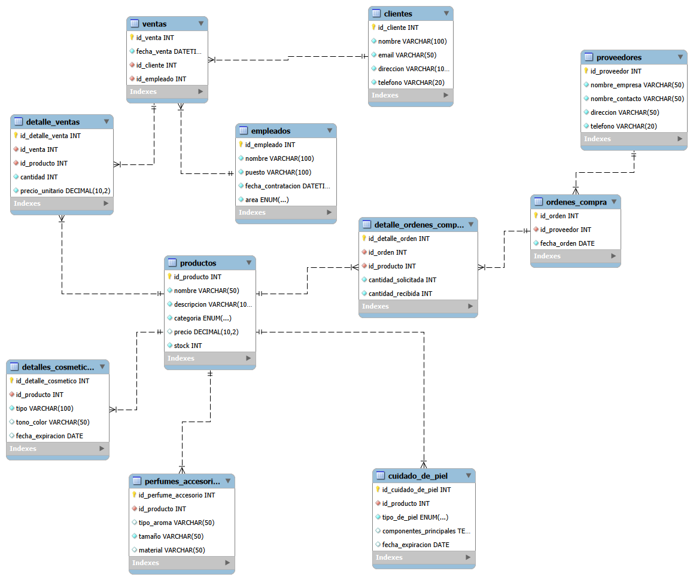

# Tienda de maquillaje — Base de datos

Modelo y scripts SQL para la base de datos de una tienda de maquillaje (cosméticos,
cuidado de la piel, perfumes y accesorios). La base guarda productos, clientes,
ventas, empleados y proveedores con sus órdenes de compra.

Trabajo para la materia de Bases de Datos. Probado en **MySQL 8** con MySQL Workbench.

## Contenido del repositorio

| Archivo | Qué contiene |
|---|---|
| `ddl.sql` | Creación de la base de datos y de todas las tablas, con sus llaves primarias y foráneas. |
| `dml.sql` | Datos de prueba (`INSERT`) para todas las tablas. |
| `dql.sql` | Las 10 consultas pedidas, cada una dentro de una función o un procedimiento almacenado, más ejemplos de uso al final. |
| `er.png` | Diagrama entidad–relación. |
| `README.md` | Este documento. |

## Cómo ejecutarlo

Hay que correr los scripts **en este orden**, porque cada uno depende del anterior:

```sql
SOURCE ddl.sql;   -- 1. crea la BD y las tablas
SOURCE dml.sql;   -- 2. inserta los datos de prueba
SOURCE dql.sql;   -- 3. crea las funciones y procedimientos
```

El `ddl.sql` hace `DROP TABLE IF EXISTS` al inicio, así que se puede volver a correr
sin problema para dejar la base limpia.

## Diagrama entidad–relación



### Tablas

- **clientes** — datos de la persona que compra (nombre, correo único, dirección, teléfono).
- **empleados** — quién atiende; incluye el puesto, la fecha de contratación y el área
  (`venta`, `bodega` o `administración`).
- **proveedores** — empresa que surte los productos y su contacto.
- **productos** — información común a cualquier producto: nombre, descripción, categoría,
  precio y stock.
- **detalles_cosmeticos**, **cuidado_de_piel**, **perfumes_accesorios** — cada una
  extiende a `productos` con los campos propios de esa categoría (tipo y tono del
  cosmético, tipo de piel y componentes, aroma / tamaño / material, etc.).
- **ventas** y **detalle_ventas** — la venta guarda fecha, cliente y empleado; el
  detalle guarda cada producto de esa venta con su cantidad y el precio al que se vendió.
- **ordenes_compra** y **detalle_ordenes_compra** — la orden guarda proveedor y fecha;
  el detalle guarda los productos pedidos, la cantidad solicitada y la cantidad recibida.

### Relaciones principales

| Relación | Tipo |
|---|---|
| `clientes` → `ventas` | 1 a N |
| `empleados` → `ventas` | 1 a N |
| `ventas` → `detalle_ventas` | 1 a N (borrado en cascada) |
| `productos` → `detalle_ventas` | 1 a N |
| `productos` → `detalles_cosmeticos` / `cuidado_de_piel` / `perfumes_accesorios` | 1 a 1 (opcional, en cascada) |
| `proveedores` → `ordenes_compra` | 1 a N |
| `ordenes_compra` → `detalle_ordenes_compra` | 1 a N (borrado en cascada) |
| `productos` → `detalle_ordenes_compra` | 1 a N |

## Consultas (archivo `dql.sql`)

Para cada consulta del taller se creó una función o un procedimiento. Al final del
archivo quedan las llamadas de ejemplo.

| # | Consulta | Rutina | Ejemplo de uso |
|---|---|---|---|
| 1 | Listar los productos de cosméticos de un tipo específico | `sp_cosmeticos_por_tipo` | `CALL sp_cosmeticos_por_tipo('labial');` |
| 2 | Productos de una categoría con stock por debajo de un valor | `sp_productos_categoria_stock_bajo` | `CALL sp_productos_categoria_stock_bajo('cosmeticos', 10);` |
| 3 | Ventas de un cliente en un rango de fechas | `sp_ventas_cliente_rango` | `CALL sp_ventas_cliente_rango(3, '2026-01-01', '2026-12-31');` |
| 4 | Total de ventas de un empleado en un mes | `fn_total_ventas_empleado_mes` | `SELECT fn_total_ventas_empleado_mes(2, 2026, 1);` |
| 5 | Productos más vendidos en un período | `sp_productos_mas_vendidos` | `CALL sp_productos_mas_vendidos('2025-09-01', '2026-09-09');` |
| 6 | Stock de un producto por nombre o por ID | `sp_consultar_stock` | `CALL sp_consultar_stock(1, NULL);` / `CALL sp_consultar_stock(NULL, 'Labial');` |
| 7 | Órdenes de compra a un proveedor en el último año | `sp_ordenes_proveedor_ultimo_anio` | `CALL sp_ordenes_proveedor_ultimo_anio(1);` |
| 8 | Empleados que llevan más de un año en la tienda | `sp_empleados_antiguedad_mayor_anio` | `CALL sp_empleados_antiguedad_mayor_anio();` |
| 9 | Cantidad total de productos vendidos en un día | `fn_total_productos_vendidos_dia` | `SELECT fn_total_productos_vendidos_dia('2025-06-05');` |
| 10 | Ventas de un producto (por nombre o ID) y unidades vendidas | `sp_ventas_por_producto` | `CALL sp_ventas_por_producto(1, NULL);` |

En las consultas 6 y 10 se pasa el ID **o** el nombre; el parámetro que no se use va en `NULL`.

## Notas de diseño

- Los datos específicos de cada categoría de producto se separaron en tablas aparte
  en lugar de dejar muchas columnas vacías en `productos`.
- `detalle_ventas` guarda el `precio_unitario` de la venta y no se toma el precio actual
  del producto, porque el precio puede cambiar después.
- Las llaves foráneas de los "detalle_" tienen `ON DELETE CASCADE` para que al borrar
  una venta u orden se borren sus líneas.
- El área de los empleados es un `ENUM('venta','bodega','administración')`.

## Autora

Lesli Zuñiga
